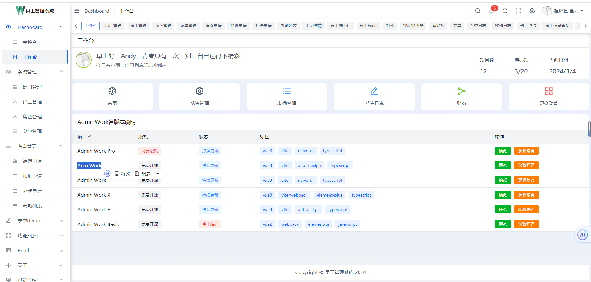
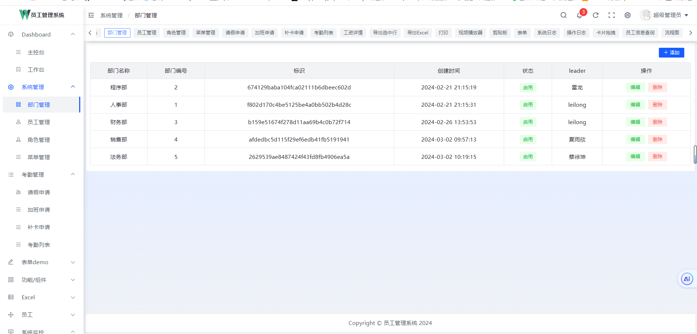
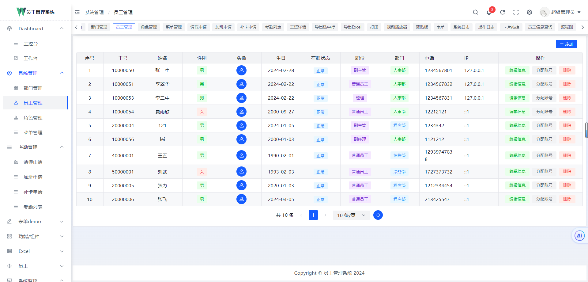
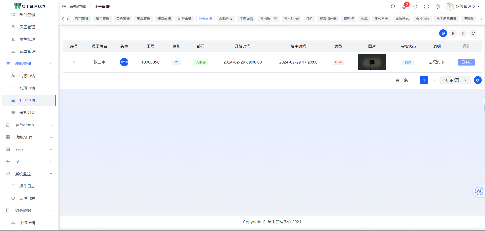
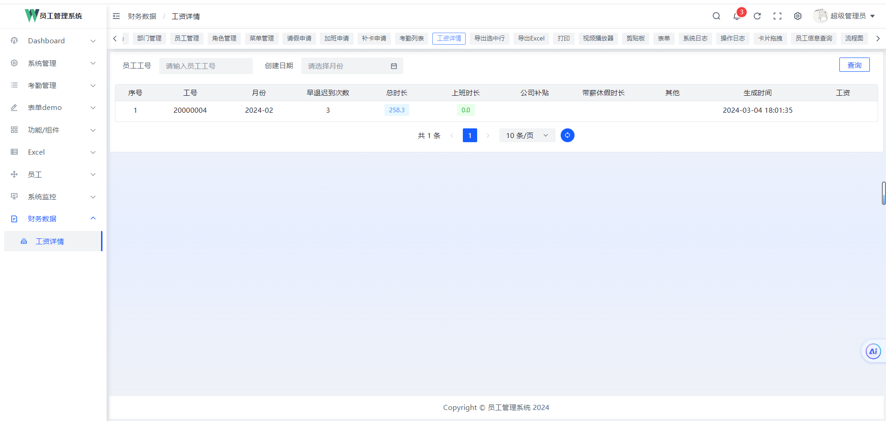
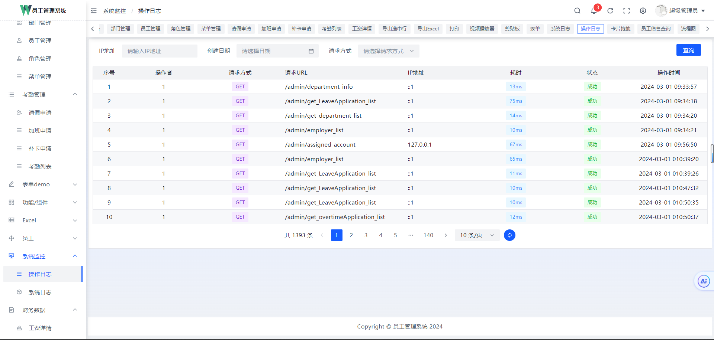
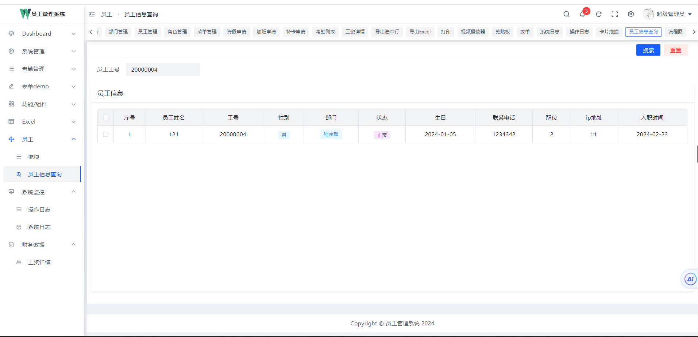
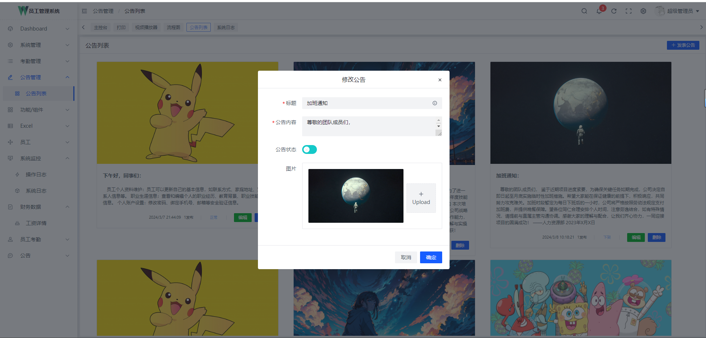

# 员工管理系统

## 1. 后端 Gin + Gorm + Go-Redis + Casbin + Jwt +Viper+ Ants

```textmate
这是我的毕业设计，我是学的后端，前端也是自己学了一点，前端方面代码肯定会有很多不足，可以自己尝试取改写一下
后端完全是自己写出来的，也有很多地方没有完善，大家可以拿去参考
```

## 2. 前端 Vue3+Arco Work(基于字节的Arco.design封装)

[Arco Work 的 Github 地址](   https://github.com/qingqingxuan/arco-work)

## 3. 效果图

<table border="1" cellpadding="1" cellspacing="1" style="width: 500px">
    <tbody>
        <tr>
            <td></td>
            <td></td>
        </tr>
        <tr>
            <td></td>
            <td></td>
        </tr>  
        <tr>
            <td></td>
            <td></td>
        </tr>  
         <tr>
            <td></td>
            <td></td>
        </tr>  
        <tr>
            <td></td>
            <td></td>
        </tr>
        <tr>
            <td></td>
            <td></td>
        </tr>
    </tbody>
</table>

## 4.后端启动

### 1.下载依赖

```shell
go  mod tidy  
```

### 2.创建数据库

```mysql
use server;

create
databsae server;
```

### 3.启动

```shell
go  run main.go
```

### 4.配置文件在config.yaml中

```yaml
#服务器相关配置
service:
  port: 8084
  name: "server"
  readTime: 10
  writeTime: 10
  maxHeaderBytes: 1

#mysql数据库
mysql:
  username: "root"
  password: " mysql 密码"
  database: "server"
  url: "127.0.0.1"

#redis数据库
redis:
  addr: "redis 地址"
  db: 0
  password: "redis 密码"
  poolsize: 1000
  maxidleconns: 1000
  minidleconns: 10
  connMaxIdleTime: 10
  Times: 5

#Jwt
jwt:
  time: 120  #token有效期   单位是 h
  key: "welcome to use Tally by M"

#日志相关配置
Logs:
  leave: "info"
  prefix: "server"
  path: "./log/"
  maxsize: 100

#cos
tencentCos:
  url: "存储桶路径"
  secretId: ""
  secretKey: ""

#  协程池
Pool:
  size: 10      #协程池数量
  num: 10      # 协程池中协程数量

```

## 5.如果觉得不错，可以给一个star