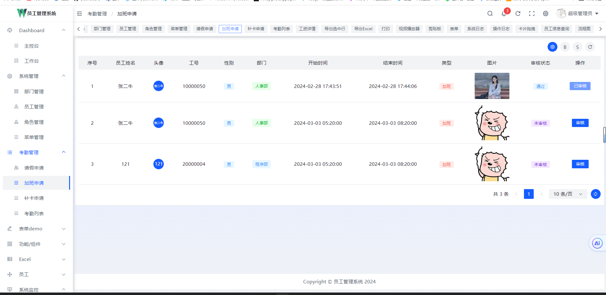

# 员工管理系统

## 1. 后端 Gin + Gorm + Go-Redis + Casbin + Jwt +Viper+ Ants

```textmate
这是我的毕业设计，我只会后端，前端也是自己学了一点，前端方面代码肯定会有很多不足，可以自己尝试取改写一下
后端完全是自己写出来的，也有很多地方没有完善，大家可以拿去参考
```

## 2. 前端 Vue3+Arco Work(基于字节的Arco.design封装)

## 3. 效果图

<table border="1" cellpadding="1" cellspacing="1" style="width: 500px">
    <tbody>
        <tr>
            <td></td>
            <td></td>
        </tr>
        <tr>
            <td></td>
            <td></td>
        </tr>  
        <tr>
            <td></td>
            <td></td>
        </tr>  
         <tr>
            <td></td>
            <td></td>
        </tr>  
<tr>
            <td></td>
            <td></td>
        </tr>
    </tbody>
</table>
